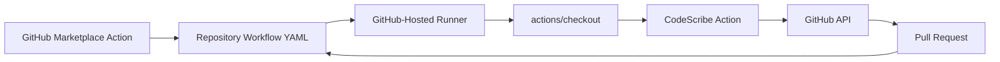

# Deployment Architecture

```mermaid
flowchart LR
    Marketplace["GitHub Marketplace Action"]
    RepoWorkflow["Repository Workflow YAML"]
    Runner["GitHub-Hosted Runner"]
    Checkout["actions/checkout"]
    CodeScribe["CodeScribe Action"]
    GitHubAPI["GitHub API"]
    PR["Pull Request"]

    Marketplace --> RepoWorkflow
    PR --> RepoWorkflow
    RepoWorkflow --> Runner
    Runner --> Checkout
    Checkout --> CodeScribe
    CodeScribe --> GitHubAPI
    GitHubAPI --> PR
```

Adopters install CodeScribe by referencing the action in workflow YAML. The only runtime
infrastructure required is GitHub Actions.
