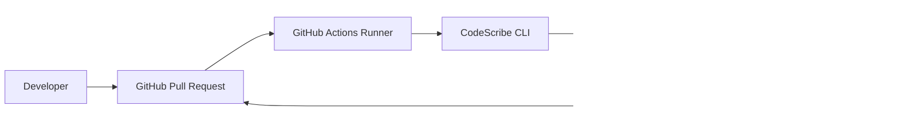

# High-Level Architecture

```mermaid
flowchart LR
    Developer["Developer"]
    PR["GitHub Pull Request"]
    Actions["GitHub Actions Runner"]
    CLI["CodeScribe CLI"]
    Analysis["Analysis Services"]
    LLM["LLM Provider"]
    Outputs["PR Summary, Review Comments, documentation.md"]

    Developer --> PR
    PR --> Actions
    Actions --> CLI
    CLI --> Analysis
    Analysis --> LLM
    LLM --> Analysis
    Analysis --> Outputs
    Outputs --> PR
```

CodeScribe runs inside GitHub Actions. The checked-out pull request is analyzed locally in the
runner, and enabled outputs are sent back to the same PR.
