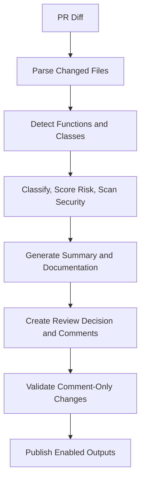

# LangGraph Agent Workflow

The graph keeps the PR review path linear and auditable: understand the diff, generate grounded
analysis, validate branch edits, then publish only the outputs the repository enabled.
