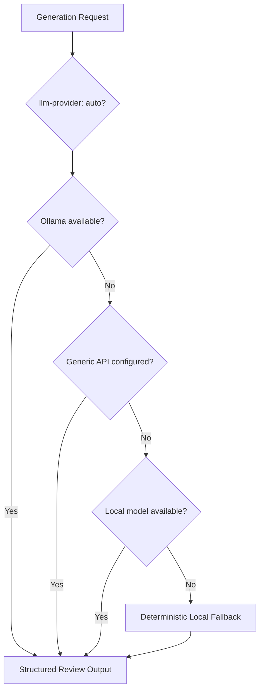

# LLM Provider Fallback Chain

```mermaid
flowchart TD
    Request["Generation Request"]
    Auto{"llm-provider: auto?"}
    Ollama{"Ollama available?"}
    Generic{"Generic API configured?"}
    LocalModel{"Local model available?"}
    Fallback["Deterministic Local Fallback"]
    Result["Structured Review Output"]

    Request --> Auto
    Auto --> Ollama
    Ollama -- Yes --> Result
    Ollama -- No --> Generic
    Generic -- Yes --> Result
    Generic -- No --> LocalModel
    LocalModel -- Yes --> Result
    LocalModel -- No --> Fallback
    Fallback --> Result
```

The fallback chain keeps PR review workflows running even when an external model is unavailable.
