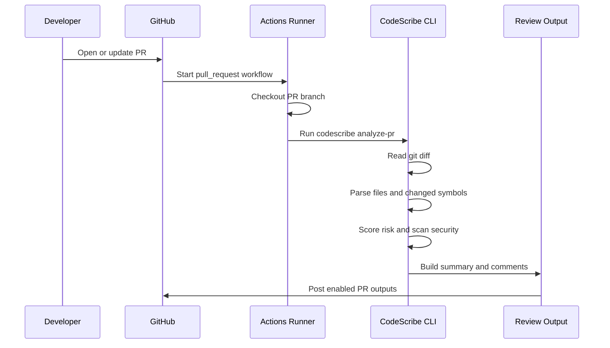

# PR Processing Flow

```mermaid
sequenceDiagram
    participant Dev as Developer
    participant GitHub as GitHub
    participant Runner as Actions Runner
    participant CodeScribe as CodeScribe CLI
    participant Review as Review Output

    Dev->>GitHub: Open or update PR
    GitHub->>Runner: Start pull_request workflow
    Runner->>Runner: Checkout PR branch
    Runner->>CodeScribe: Run codescribe analyze-pr
    CodeScribe->>CodeScribe: Read git diff
    CodeScribe->>CodeScribe: Parse files and changed symbols
    CodeScribe->>CodeScribe: Score risk and scan security
    CodeScribe->>Review: Build summary and comments
    Review->>GitHub: Post enabled PR outputs
```

The workflow starts from GitHub's native `pull_request` event and runs inside the Actions runner.
